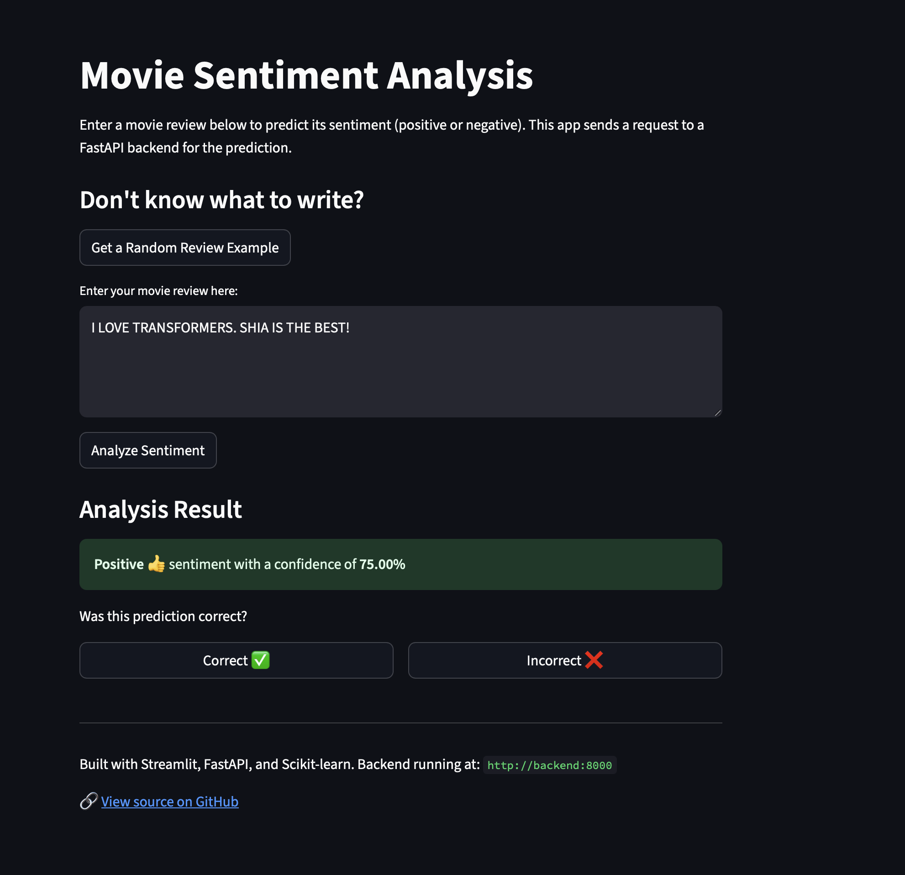
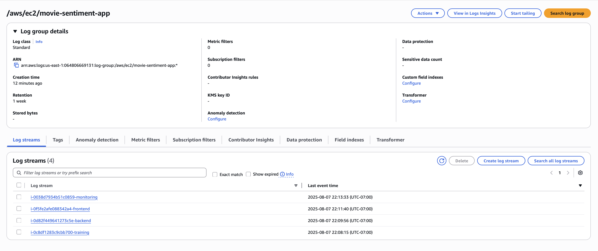

# Movie Sentiment Analysis - AWS Deployment

This project deploys a movie sentiment analysis application on AWS using a fully automated Terraform setup. The architecture consists of a FastAPI backend, a Streamlit frontend, ML training, and a Streamlit monitoring dashboard. Each service runs in a Docker container on their own dedicated EC2 instances.

This project is structured as a multi-package monorepo using `uv` workspaces. Each application (`fastapi_backend`, `streamlit_frontend`, `sklearn_training`, `streamlit_monitoring`) has its own modules and dependencies while sharing a single `uv.lock` file at the root.

## AWS Architecture


### Filetree
```bash
.
├── assets
│   ├── data    # Local data stored/staged here
│   ├── images  # Documentation images
│   ├── logs    # App logs 
│   ├── models  # Local model stored/staged here
│   └── scripts 
├── config.yaml # Sets env-aware variables/paths
├── docker-compose.yml # Docker services configuration
├── pyproject.toml # Dependencies
├── README.md
├── src
│   ├── core    # Shared utilities
│   │   ├── __init__.py
│   │   ├── asset_resolution.py
│   │   ├── aws.py
│   │   ├── base_logger.py
│   │   ├── load_config.py
│   │   └── logging_config.py
│   ├── fastapi_backend # Backend service
│   │   ├── Dockerfile
│   │   ├── __init__.py
│   │   ├── main.py
│   │   └── utils
│   │       ├── __init__.py
│   │       ├── middleware.py
│   │       ├── model_loader.py
│   │       └── schemas.py
│   ├── sklearn_training # ML training service
│   │   ├── Dockerfile
│   │   ├── __init__.py
│   │   ├── train_model.py
│   │   └── utils
│   │       ├── __init__.py
│   │       └── data_loader.py
│   ├── streamlit_frontend # Frontend service
│   │   ├── Dockerfile
│   │   ├── __init__.py
│   │   └── app.py
│   └── streamlit_monitoring # Monitoring service
│       ├── Dockerfile
│       ├── __init__.py
│       ├── app.py
│       └── utils
│           ├── __init__.py
│           └── data_loader.py
└── terraform
    ├── cloudwatch.tf # CloudWatch config
    ├── ec2.tf       # EC2 config
    ├── modules      # Re-usable modules for Docker deployment
    │   └── docker_deployment
    │       ├── main.tf
    │       └── variables.tf
    ├── providers.tf
    ├── s3.tf           # S3 config
    ├── security_groups.tf # Security group config
    └── variables.tf    # Expected vars
```

Architecture Overview:
- ML Training Service (EC2): Downloads data, trains model, uploads to S3
- FastAPI Backend (EC2): Provides inference API
- Streamlit Frontend (EC2): User interface
- Streamlit Monitoring (EC2): ML Model Monitoring
- S3: Stores model and data files
- DynamoDB: Stores ML performance monitoring logs
- Infrastructure:
  - Terraform manages AWS resources (EC2, S3, Security Groups, CloudWatch)
  - Automated deployment with Docker containers
  - CloudWatch logging

## Local Architecture
Locally, this project is orchestrated by Docker Compose. Each service is still containerized with the same exact logic/code flow as the AWS deployment and has the same overall architecture as the depicted diagram above. However, when running with the environment variable `APP_ENV=development` (automatically done in `task aws-dev:up`), the application uses the `config.yaml` to determine which local file paths to use instead of S3:

```yaml
development:
  paths: # Local file paths
    data: "assets/data/IMDB Dataset.csv"
    model: "assets/models/sentiment_model.pkl"
  prediction_logging:
    handler: "file"
    path: "assets/logs/prediction_logs.json"    
```

## Local Dev Deployment 

### Prerequisites
- `uv>=0.7.10`
  - [uv installation](https://docs.astral.sh/uv/getting-started/installation/)
- `task>=3.43.3`
  - [task installation](https://taskfile.dev/installation/)
- [Docker](https://docs.docker.com/get-docker/) and [Docker Compose](https://docs.docker.com/compose/install/) installed on your local machine.

### Local Configuration
For running this project on your local machine, no configuration is needed. The application will use your local files instead of S3 for storage and your CPU for computation.

### Local Development with Docker Compose
For a streamlined and consistent development experience that mirrors the production environment locally, you can use Docker Compose and the custom `task` commands.
From the root of the project (`mlops-du/`), you can use the following commands:
1.  Build and Start All Services

    This single command builds the Docker images for ML training, the FastAPI backend, and the Stramlit frontend, and then starts them in the correct order. It will first run the training container to generate the model and then launch the backend and frontend services.

    ```bash
    task aws-dev:up
    ```

    You will see the logs from all services streamed to your terminal.

2.  Access the Applications!

    - **Frontend URL**: [http://localhost:8501](http://localhost:8501)
      - Write a review
      - Get the predicted sentiment
      - Provide feedback for whether the sentiment was correct or not
    - **Monitoring URL**: [http://localhost:8502](http://localhost:8502)
      - You can view the performance/status of the ML sentiment app here
    - **Backend API Docs**: [http://localhost:8000/docs](http://localhost:8000/docs)
    - Note: If you want to follow the logs of the running services without blocking your main terminal, you can run:
      ```bash
      task aws-dev:logs
      ```

3. With the services up (mainly FastAPI), you can run tests via the eval task or manually running `CURL` commands:

    Using the evaluator script in `assets/scrpits/evaluator.py` via task:
    ```bash
    task aws-dev:eval
    ```

    This should output:
    ```bash
    Accuracy: 91.38% (159/174)
    ```

    Using `curl` commands:
    ```bash
    curl http://localhost:8000/health

    curl -X POST http://localhost:8000/predict -H "Content-Type: application/json" -d '{"text": "Transformers was great."}'

    curl -X POST http://localhost:8000/predict_proba -H "Content-Type: application/json" -d '{"text": "Transformers was great."}'

    curl http://localhost:8000/example
    ```

4.  Stop and Clean Up

    To stop all the running services and remove the containers and network, run:

    ```bash
    task aws-dev:down
    ```

## AWS Prod Deployment 

### Prerequisites
- The following need to be installed:
  - [AWS CLI](https://docs.aws.amazon.com/cli/latest/userguide/getting-started-install.html)
    - Need an AWS account with programmatic access along with the following credentials:
      - aws_access_key_id
      - aws_secret_access_key
      - aws_session_token
  - [Terraform](https://learn.hashicorp.com/tutorials/terraform/install-cli) installed on your local machine.
  - [uv](https://github.com/astral-sh/uv) installed on your local machine.
  - Docker Desktop (Contains both the Engine and CLI Client)
    - [docker installation](https://docs.docker.com/desktop/)

### Configuration for AWS Deployment
Within `mlops-du/assignments/movie-sentiment-aws`, create an `.env` file and add the following:
```
# For AWS CLI / Boto3
AWS_ACCESS_KEY_ID=
AWS_SECRET_ACCESS_KEY=
AWS_SESSION_TOKEN=

# For Terraform (re-using the same values as above)
TF_VAR_aws_access_key_id=$AWS_ACCESS_KEY_ID
TF_VAR_aws_secret_access_key=$AWS_SECRET_ACCESS_KEY
TF_VAR_aws_session_token=$AWS_SESSION_TOKEN
```
While these AWS credentials are really only used in production, they are needed locally for Terraform for authentication in order to run CLI commands like `plan` and `apply` as well as for passing directly to the EC2 instances at launch time.


## AWS Deployment with Terraform

This workflow provisions the entire infrastructure and deploys the applications with Terraform.

### Step 1: Initialize Terraform and Create S3 Bucket

1.  Initialize Terraform

    From the root of the project (`mlops-du/`), run the following command to initialize Terraform. This will download the necessary providers and set up the backend.

    ```bash
    task aws-prod:init
    ```

2.  Create the S3 Bucket

    Next, create the S3 bucket that will be used to store the model and data artifacts.

    ```bash
    task aws-prod:s3 S3_BUCKET=<your-unique-bucket-name> # Defaults to movie-sentiment-s3
    ```

    > **Note**: Because the `awsstudent` role has very limited permissions, there are issues with Terraform when it tries to automatically check the state of some resources (S3 mainly) via the object lock. Because of this, you have to manually create an S3 bucket.

### Step 2: Deploy the Application

1.  Apply the Terraform Plan

    Run the following command to create the AWS resources and deploy the application. Terraform will show you a plan and ask for confirmation before proceeding.

    ```bash
    task aws-prod:apply S3_BUCKET=<your-unique-bucket-name> # Defaults to movie-sentiment-s3
    ```

    This process will take a few minutes as the EC2 instances need to start, transfer necessary application files, install dependencies, build the Docker images, and run them.

### Step 3: Access the App

Once the `terraform apply` command is complete, it will output the public IP address of the frontend application.

- **Frontend URL**: `http://<FRONTEND_PUBLIC_IP>:8501`
- **Monitoring URL**: `http://<MONITORING_PUBLIC_IP>:8502`
- **Backend URL**: `http://<BACKEND_PUBLIC_IP>:8000`

### Step 4: Cleanup

To tear down all the AWS resources created by this project, run the `destroy` command from the `terraform` directory.

  ```bash
  task aws-prod:destroy
  ```
Note:

If your Terraform lockfiles and states get out of sync and are causing you issues, run:

  ```bash
  task aws-prod:reset
  ```
This will delete all the local Terraform artifacts (to release the lock and reset state) and will re initialize Terraform.

# Screenshots

#### Terraform CLI Output 


#### S3 Bucket


#### EC2 Instances


#### FastAPI Backend Docs Endpoint


#### Streamlit Frontend with Feedback for Monitoring


### Stramlit Monitoring


### Log Groups and Streams


### Traning Logs


### Backend Logs


### Frontend Logs


### Monitoring Logs
