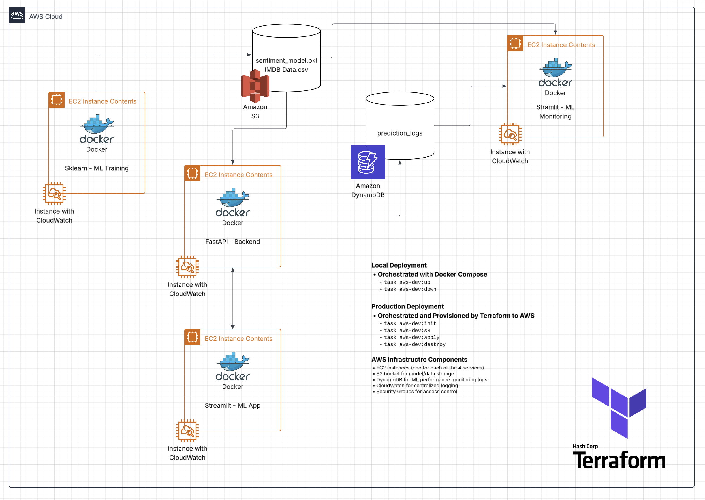

# Movie Sentiment Analysis - AWS Deployment

This project deploys a movie sentiment analysis application on AWS using a fully automated Terraform setup. The architecture consists of a FastAPI backend, a Streamlit frontend, and  ML training. Each service runs in a Docker container on their own dedicated EC2 instances.

This project is structured as a multi-package monorepo using `uv` workspaces. Each application (`fastapi_backend`, `streamlit_frontend`, `sklearn_training`) has its own modules and dependencies while sharing a single `uv.lock` file at the root.

## Basic Architecture

This project is a MINIMAL deployment approach to serving an ML model. This is purely for learning purposes and is missing a lot of MLOps best-practices in terms of observability, monitoring, re-training, CI/CD, etc.



### Filetree
```bash
.
├── assets
│   ├── data # Local data stored/staged here
│   ├── logs # App logs 
│   └── models # Local model stored/staged here
├── config.yaml # Sets env-aware variables/paths
├── pyproject.toml # Dependencies
├── README.md
├── src
│   ├── fastapi_backend # Backend service
│   │   ├── Dockerfile
│   │   ├── main.py
│   │   ├── model_loader.py
│   │   └── schemas.py
│   ├── sklearn_training # ML training service
│   │   ├── Dockerfile
│   │   ├── data_loader.py
│   │   └── train_model.py
│   └── streamlit_frontend # Frontend service
│   │   ├── Dockerfile
│   │   └── app.py
│   └── utils # Shared utils (S3 interaction) need to refactor this..
└── terraform
   ├── ec2.tf # EC2 config
   ├── modules # Re-usable modules for Docker deployment
   │   └── docker_deployment
   │       ├── main.tf
   │       └── variables.tf
   ├── providers.tf
   ├── s3.tf # S3 config
   ├── security_groups.tf # Security group config
   └── variables.tf # Expected vars
```


- **ML Training**: Traning service on EC2 to download data, train ML model, and push data/model file to S3.
- **Backend**: FastAPI service running on a dedicated EC2 instance.
- **Frontend**: Streamlit application running on a dedicated EC2 instance.
- **Infrastructure**: All AWS resources (EC2, S3, Security Groups) are managed by Terraform.
- **Automation**: EC2 instances are provisioned by Terraform which uses remote-exec provisioners to SSH into each instance after launch. These scripts install Docker and Git, transfer diles, build the required Docker images, and start the FastAPI or Streamlit containers with the correct environment variables. Configuration files are copied as needed and services are started automatically!

## Prerequisites

- AWS Account: An AWS account with programmatic access
- The following need to be installed:
  - [AWS CLI](https://docs.aws.amazon.com/cli/latest/userguide/getting-started-install.html)
  - [Terraform](https://learn.hashicorp.com/tutorials/terraform/install-cli) installed on your local machine.
  - [uv](https://github.com/astral-sh/uv) installed on your local machine.

## Configuration

This project uses two different configuration methods depending on the environment (development vs production).

### Local Development (`.env` file) via Local Files

For running this project on your local machine, configuration is managed via a `.env` file in the project root. The application will use your local files instead of S3 for storage and your CPU for computation.
    ```
    # Within your root .env file (you must create this file)
    # Set the application environment. Options: 'development' or 'production'
    APP_ENV=development

    # AWS Credentials for Boto3 (only used in production, but needed locally for Terraform)
    AWS_ACCESS_KEY_ID=
    AWS_SECRET_ACCESS_KEY=
    AWS_SESSION_TOKEN=
    AWS_DEFAULT_REGION=us-east-1
    ```

### AWS Deployment (`terraform.tfvars`) via Terraform

When deploying to AWS with Terraform, configuration is passed directly to the EC2 instances at launch time. **This method does NOT use the `.env` file**

Key variables are handled as follows:

-   APP_ENV: This is automatically set to `"production"` inside the startup scripts in `terraform/ec2.tf`.
-   AWS Credentials: These are passed securely from your `terraform/terraform.tfvars` file to the Docker containers.
    ```
    Within terraform/terraform.tfvars (you must create this file)
    # AWS Credentials
    aws_access_key_id     = ""
    aws_secret_access_key = ""
    aws_session_token     = ""
    aws_region = "us-east-1"
    ```

## Local Development

1. Navigate to `movie-sentiment-aws`

```bash
cd assignments/movie-sentiment-aws 
```

2. Install dependencies

```bash
uv sync --all-packages
```

3. In the terminal, run the training script:

```bash
uv run python -m src.sklearn_training.train_model
```

4. In a separate terminal, run the FastAPI Backend:

```bash  
uv run uvicorn src.fastapi_backend.main:app --host 0.0.0.0 --port 8000
```

5. In another, separate teminal, run the Streamlit Frontend:

```bash
uv run streamlit run src/streamlit_frontend/app.py
```

6. Open the Frontend URL in your browser and run sentiment analysis!
    - Frontend URL: http://<FRONTEND_PUBLIC_IP>:8501

## Automated AWS Deployment via Terraform

This workflow provisions the entire infrastructure and deploys the applications with Terraform.

### Step 1: Configure Your Terraform Environment

1. Navigate to the `terraform/` directory
    ```bash
    cd terraform/
    ```

2. Export AWS credentials from `.env` file for Terraform
    Terraform will use these variables to authenticate with your AWS account.
    ```bash
    set -a
    source .
    set +a
    ```

3. Manually Create S3 Bucket via AWS CLI
    
    Because the `awsstudent` role has very limited permissions, there are issues with Terraform when it tries to automatically check the state of some resources (S3 mainly) via
    the object lock:
    ```bash
    # Error message I keep getting
    AccessDenied: User: arn:aws:sts::614899697409:assumed-role/voclabs/user4228548=jairus is not authorized to perform: s3:GetBucketObjectLockConfiguration on resource: "arn:aws:s3:::movie-sentiment-s3-dig97dh6" with an explicit deny in an identity-based policy
    ```

    Because of this, you have to manually create an S3 bucket either through the AWS Console or CLI. 
    ```bash
    # example
    aws s3api create-bucket --bucket movie-sentiment-s3 --region us-east-1
    ```

4. Confirm Terraform Variables File

    Make sure you have have the necessary credentials in the `terraform.tfvars` file (in addition to exporting the env vars in the terminal session for Terraform). This file will securely store the variables needed for deployment. 

### Step 2: Deploy the Application

1. Initialize Terraform
   From the `terraform/` directory, run `terraform init` to prepare the workspace.

    ```bash
    terraform init
    ```

2. Apply the Terraform Plan

    Run `terraform apply` to create the AWS resources and deploy the application. Terraform will show you a plan and ask for confirmation before proceeding.

    ```bash
    terraform apply
    ```

    This process will take a few minutes as the EC2 instances need to start, transfer necessary application files, install dependencies, build the Docker images, and run them.

### Step 3: Access the App

Once the `terraform apply` command is complete, it will output the public IP address of the frontend application.

- **Frontend URL**: `http://<FRONTEND_PUBLIC_IP>:8501`

## Cleanup

To tear down all the AWS resources created by this project, run the `destroy` command from the `terraform` directory.

```bash
terraform destroy
```