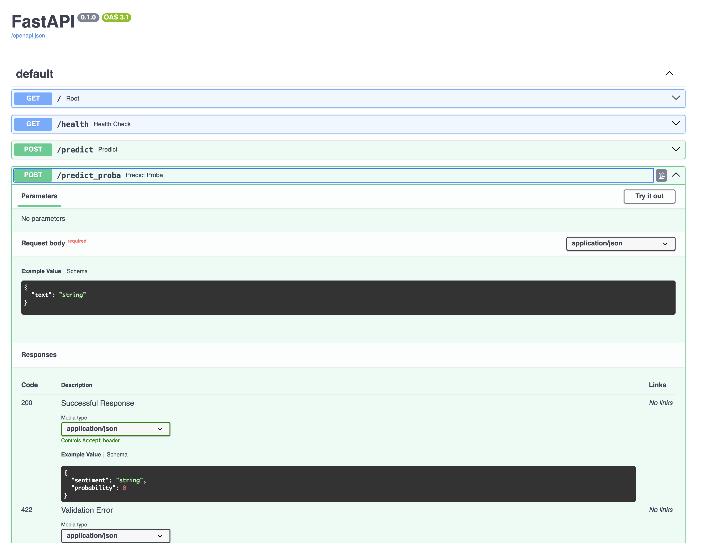
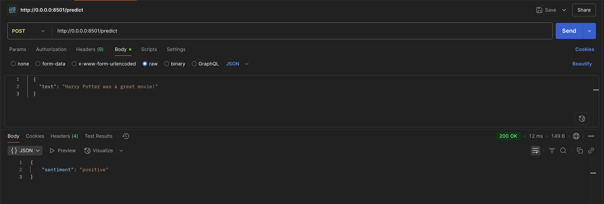
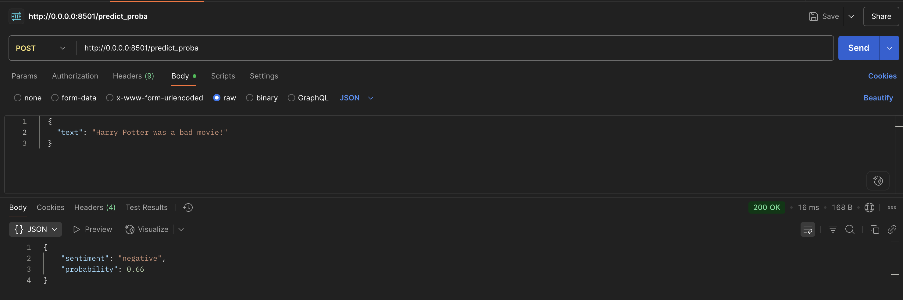
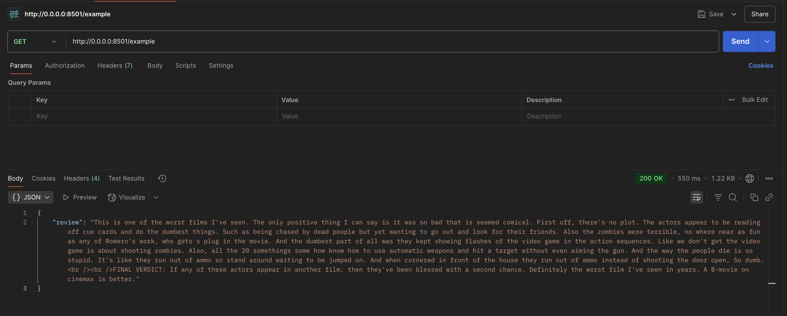

# FastAPI Movie Sentiment Analysis API

A REST API that performs sentiment analysis on movie reviews using a machine learning model. The API provides endpoints for predicting sentiment (positive/negative) and retrieving example reviews from the IMDB dataset.


## Project Structure
```bash
movie-sentiment-fastapi/
├── assets/
│   ├── data/                       # Dataset directory
│   ├── docs/                       # Documentation
│   ├── images/                     # Image assets
│   ├── logs/                       # App logs
│   └── models/                     # Model file
├── src/
│   ├── schemas/                    # Pydantic Models
│   ├── ml/                         # ML training / initialization
│   ├── utils/                      # Utils
│   └── main.py                     # Main entry point to run FastAPI app
├── Dockerfile                      # Docker container config
├── pyproject.toml                  # Python dependencies
└── README.md                       # Submission docs 
```

## Installation and Setup 
For prerequisites, installation instructions, and setup details, please see the top-level `README.md` file. It contains information about required dependencies, how to clone the repository, and instructions for running the installation script. It also goes over how to run and execute assignments with `task`.

### Run Options

#### Without Docker
```bash
task execute-proj PROJ=movie-sentiment-fastapi
```

#### With Docker
To run each Docker command step-by-step:
```bash
# Build Docker Container
task build PROJ=movie-sentiment-fastapi

# Run Docker Container
task run PROJ=movie-sentiment-fastapi

# Clean up: Remove Docker Image
task clean PROJ=movie-sentiment-fastapi
```

To run Docker build and run in one command:
```bash
# Build and run Docker Container
task execute-proj-docker PROJ=movie-sentiment-fastapi

# Clean up: Remove Docker Image
task clean PROJ=movie-sentiment-fastapi
```

Once the FastApi App is running, open up postman locally, and enter the base url (http://0.0.0.0:8501/). From here, you can send `GET` or `POST` requests to the following API endpoints:

## API Endpoints

- `GET /`: Root endpoint that returns a welcome message
- `GET /health`: Health check endpoint
- `POST /predict`: Predicts sentiment (positive/negative) for a given review text
  - Request body is a `JSON` object in the form of {'text': 'My movie review..'}
- `POST /predict_proba`: Predicts sentiment with probability score
  - Request body is a `JSON` object in the form of {'text': 'My movie review..'}
- `GET /example`: Returns a random movie review from the dataset

#### Docs Site
- http://0.0.0.0:8501/docs



#### Predict Sentiment
- http://0.0.0.0:8501/predict



#### Predict Sentiment with Probability
- http://0.0.0.0:8501/predict_proba



#### Example Movie Reviews
- http://0.0.0.0:8501/example


