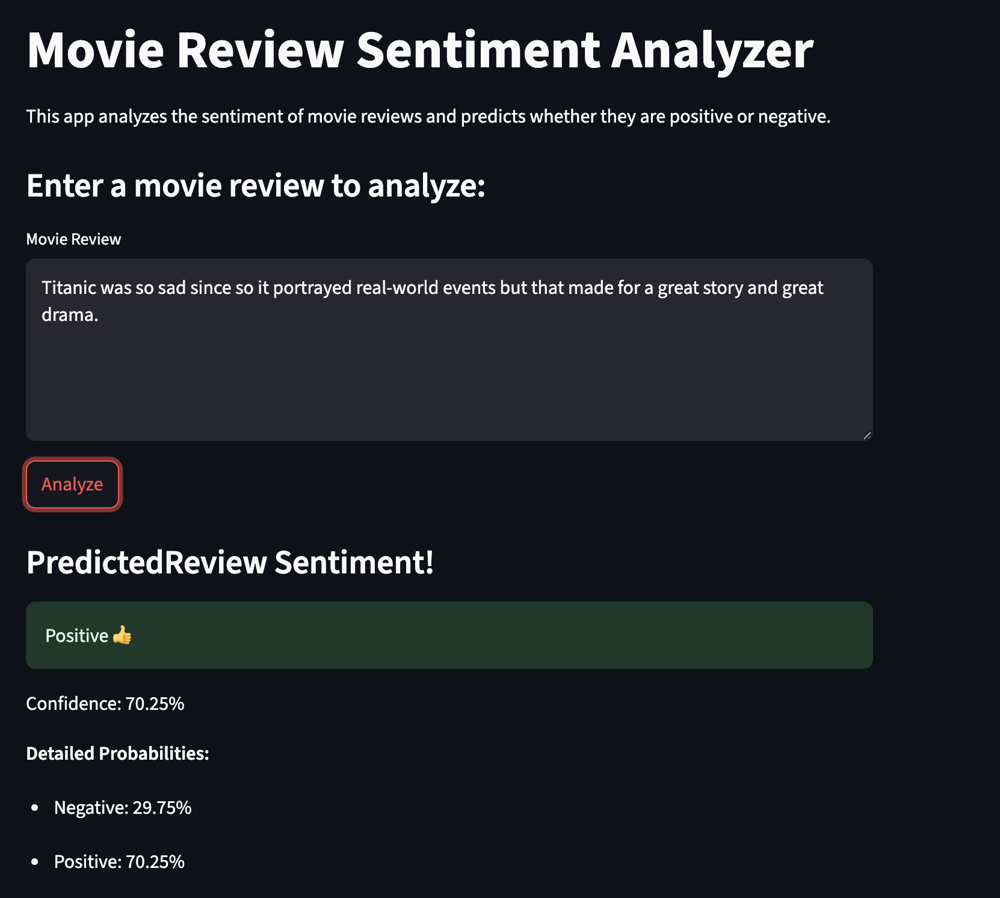
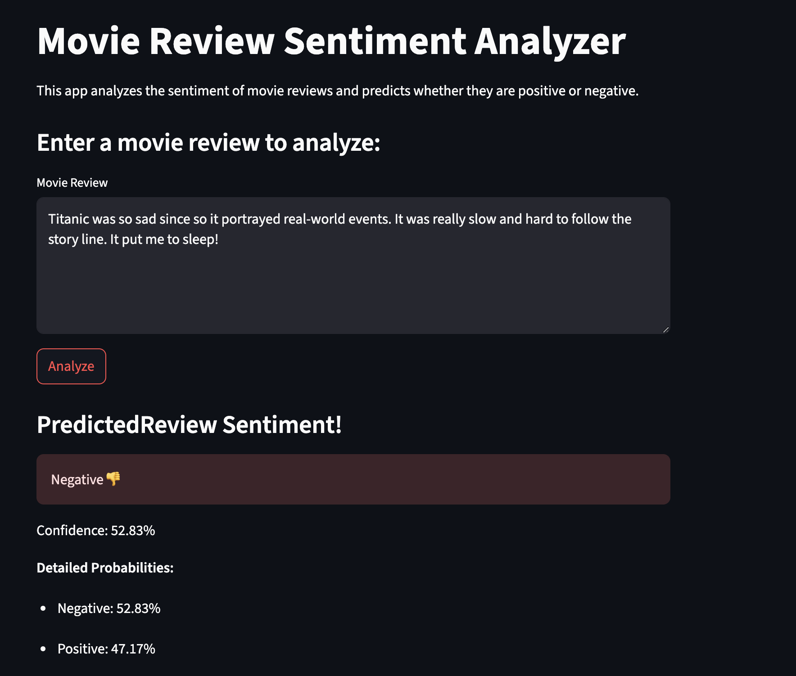

# Movie Review Sentiment Analyzer

An ML app that analyzes movie reviews and predicts whether they're positive or negative. This project uses a Naive Bayes classifier trained on the IMDB dataset to provide real-time sentiment analysis/inference through a Streamlit web UI.

## Project Structure

```
movie-sentiment-streamlit/
├── assets/
│   ├── data/                       # Dataset directory
│   ├── docs/                       # Documentation
│   ├── images/                     # Image assets
│   └── models/
│       └── sentiment_model.pkl     # Trained model file
├── src/
│   ├── train/
│   │   └── train_model.py          # Model training script
│   ├── streamlit/
│   │   └── app.py                  # Streamlit web app
│   ├── utils/                      # Utils (logging) and constants
│   └── main.py                     # Main entry point to run ML training/streamlit app
├── Dockerfile                      # Docker container config
├── pyproject.toml                  # Python dependencies
└── README.md                       # Submission docs 
```

## Installation and Setup 
For prerequisites, installation instructions, and setup details, please see the top-level `README.md` file. It contains information about required dependencies, how to clone the repository, and instructions for running the installation script. It also goes over how to run and execute assignments with `task`.

### Run Options

#### Without Docker
```bash
task execute-proj PROJ=movie-sentiment-streamlit
```

#### With Docker
To run each Docker command step-by-step:
```bash
# Build Docker Container
task build PROJ=movie-sentiment-streamlit

# Run Docker Container
task run PROJ=movie-sentiment-streamlit

# Clean up: Remove Docker Image
task clean PROJ=movie-sentiment-streamlit
```

To run Docker build and run in one command:
```bash
# Build and run Docker Container
task execute-proj-docker PROJ=movie-sentiment-streamlit

# Clean up: Remove Docker Image
task clean PROJ=movie-sentiment-streamlit
```

**Run Notes:** 
- Running `task` will automatically download the IMDB data, train the ML model, and will open the Streamlit web app in `http://localhost:8501`
  - The dataset will be downloaded from [IMDB Dataset of 50K Movie Reviews](https://www.kaggle.com/datasets/lakshmi25npathi/imdb-dataset-of-50k-movie-reviews) and placed in the `assets/data` directory.
- Once in the Streamlit UI, enter a movie review in the text area and click "Analyze" to get sentiment predictions!

## Example Output
__Positive Sentiment:__  


__Negative Sentiment:__  

