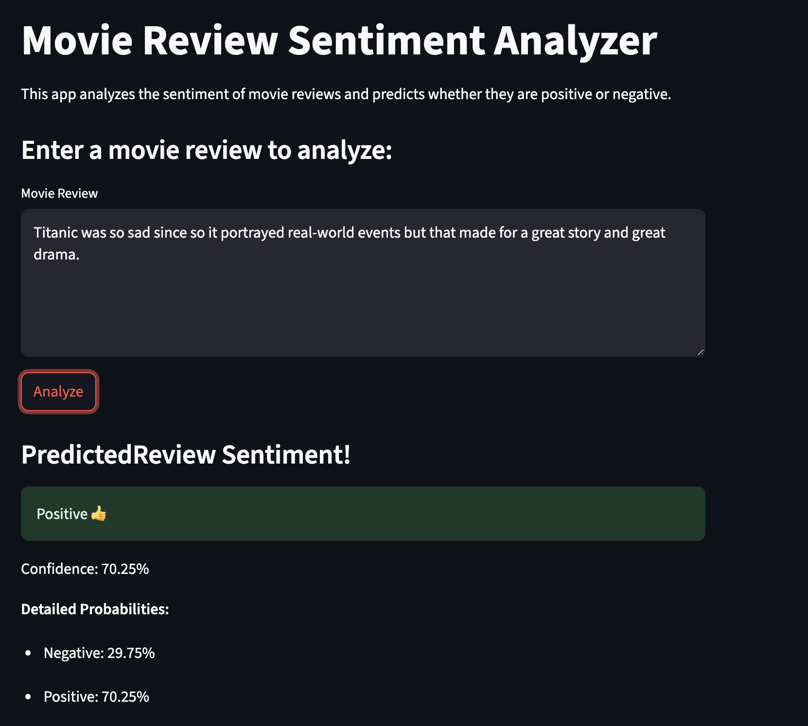
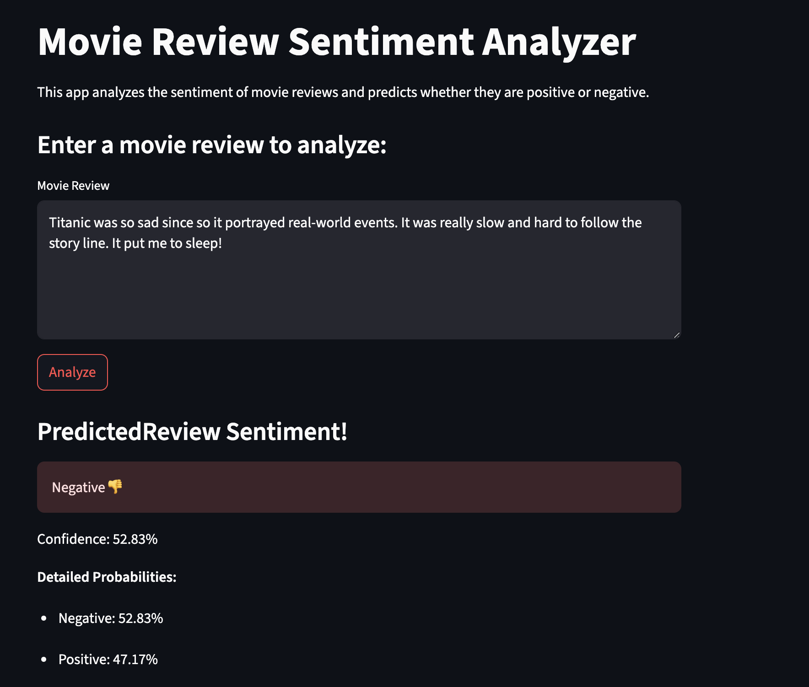

# Movie Review Sentiment Analyzer

An ML app that analyzes movie reviews and predicts whether they're positive or negative. This project uses a Naive Bayes classifier trained on the IMDB dataset to provide real-time sentiment analysis/inference through a Streamlit web interface.

## Project Structure

```
movie-sentiment/
├── assets/
│   ├── data/                       # Dataset directory
│   ├── docs/                       # Documentation
│   ├── images/                     # Image assets
│   └── models/
│       └── sentiment_model.pkl     # Trained model file
├── src/
│   ├── train/
│   │   └── train_model.py          # Model training script
│   └── streamlit/
│       └── app.py                  # Streamlit web application
├── pyproject.toml                  # Python dependencies
├── README.md                       # Submission docs 
└── uv.lock                         # uv lockfile for deps
```

## Manual Installation and Setup 
- Follow these steps if not using `task` to execute. Refer to the root-level `README.md` for simpler execution instructions.

### Clone the Repository

```bash
git clone https://github.com/jairus-m/mlops-du.git
cd mlops-du 
```

### Install Dependencies
```bash
uv sync --project assignments/movie-sentiment
```

### Activate Virtual Env
```bash
# macOS
source .venv/bin/activate
```

### Install Package in Dev Mode & CD into `movie-sentiment`
```bash
cd assignments/movie-sentiment
uv pip install -e .
```

## Usage

### Run Model Traning
**Train Model on IMBD Data and Export `.pkl` Model File**
```bash
python -m src.train.train_model
```

**Note:** The trained model (`sentiment_model.pkl`) is already included in the repo; therefore, you don't have to retrain unless you want to use different data or parameters.


### Running the Web Application
1. **Start the Streamlit app:**
```bash
streamlit run src/streamlit/app.py
```

2. **Open your browser** and navigate to the URL shown in the terminal (usually `http://localhost:8501`)

3. **Enter a movie review** in the text area and click "Analyze" to get sentiment predictions


**Note**: Make sure you have the IMDB dataset in the `assets/data/` directory if you plan to re-run the training script. The dataset should be named `IMDB Dataset.csv` and can be downloaded from [IMDB Dataset of 50K Movie ReviewsLinks to an external site.](https://www.kaggle.com/datasets/lakshmi25npathi/imdb-dataset-of-50k-movie-reviews).


## Example Output
__Positive Sentiment:__  


__Negative Sentiment:__  

